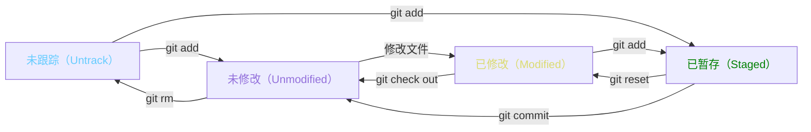

# Git

> 时间：2025/11/29
>
> 作者：clcwdans
>
> 参考：[【GeekHour】一小时Git教程_哔哩哔哩_bilibili](https://www.bilibili.com/video/BV1HM411377j?spm_id_from=333.788.videopod.sections&vd_source=ba0d19c8247bebc4f7849be5e7f55144)
>
> 日记：

## 一、初始配置

1. 用户配置

   ```bash
   git config --global user.name "{name}"
   git config --global user.email "{email}"
   ```

   参数【`--global`】

   - 省略（`Local`） 本地配置，仅对本地仓库有效

   - `--global` 全局配置，所有仓库生效
   - `--system` 系统配置，对所有用户生效  

   参数【`"{name}"`】

   - 如果 `{name}` 中间没有空格，双引号可省略
2. 保存用户密码
   ```bash
   git config --global credential.helper store
   ```

   保存用户名和密码，不用每次输入

3. 查看配置信息

   ```bash
   git config --global --list
   ```

以上命令安装后只执行一次即可

## 二、新建版本库（仓库）/ Repository (Repo)

1. 在本地目录下建立版本库

   ```bash
   git init
   # 会创建一个 .git 隐藏目录
   ```

2. 远程克隆已有的库

   ```bash
   git clone {仓库位置}
   ```

## 三、Git 工作区域和文件状态

工作区域：

1. 工作区（Working Directory）`.git` 所在目录

   资源管理器中看到的目录

2. 暂存区（Staging Area/Index）`.git/index`

   保存即将提交到 Git 仓库的修改内容

3. 本地仓库（Local Respsitory）`.git/objects`

   通过 ```git init``` 创建的仓库，是 Git 存储代码和版本信息的主要位置

工作区 --- `git add` --> 暂存区 --- `git commit` --> 本地仓库

文件状态：

1. <font color="#66CCFF"> 未跟踪（Untrack）</font>

   没有被 git 管理的文件

2. <font color="#9370DB">未修改（Unmodified）</font>

   被 git 管理，但还没被修改的文件

3. <font color="#DBDB70">已修改（Modified）</font>

   被 git 管理的已修改过，但还没加入到暂存区中的文件

4. <font color="green">已暂存（Staged）</font>

   修改后提交到暂存区中的文件



## 四、添加和提交文件

```bash
git status # 查看当前仓库状态
git add {files}
git commit {files} -m "{message}" # 如果不使用 -m，会打开一个交互界面，把修改信息写在第一行
git commit -a # 添加后提交
git commit -am "{message}"
git commit -a # 添加后提交
git commit -am "{message}"
git log # 查看提交记录
git log --oneline # 显示更为简洁的提交记录
```

> 关于 `git status -s`:
>
> `git status -s` 是 Git 命令，用于以简短格式显示工作目录和暂存区的状态。文件名前的两个字母表示文件状态，具体含义如下：
>
> 状态代码说明：
>
> - A：文件已添加到暂存区（新增文件）
> - M：文件已修改但未提交
> - D：文件已删除
> - R：文件已重命名
> - C：文件已复制（需配置 status.renames 为 "copy"）
> - U：文件更新但未合并（如冲突后未解决）
> - ?：未跟踪的文件（未被 Git 管理）
>
> ```bash
> $ git status -s
>  M git.md
> ?? .gitignore
> # 状态栏第一列表示暂存区状态，第二列表示工作区状态
> ```

> 关于 `git status -s`:
>
> `git status -s` 是 Git 命令，用于以简短格式显示工作目录和暂存区的状态。文件名前的两个字母表示文件状态，具体含义如下：
>
> 状态代码说明：
>
> - A：文件已添加到暂存区（新增文件）
> - M：文件已修改但未提交
> - D：文件已删除
> - R：文件已重命名
> - C：文件已复制（需配置 status.renames 为 "copy"）
> - U：文件更新但未合并（如冲突后未解决）
> - ?：未跟踪的文件（未被 Git 管理）
>
> ```bash
> $ git status -s
>  M git.md
> ?? .gitignore
> # 状态栏第一列表示暂存区状态，第二列表示工作区状态
> ```

## 五、回退版本

```bash
git reset --soft {version_id} # 回退到某版本并保留工作区和暂存区的修改内容
git reset --hard {version_id} # 回退到某版本并删除保留在工作区和暂存区的修改内容
git reset --mixed {version_id}# 默认，回退到某版本，仅清空暂存区
git ls-files # 查看暂存区内容
```

其中，`{version_id}` 处可用 `HEAD^` 表示上一次提交版本

> <font color="red">！谨慎使用 `--hard`</font>

但 git 中所有操作均可回溯

```bash
git reflog # 查看误操作前的版本号，再用 reset 还原即可
```

## 六、使用 `git diff` 查看差异

```bash
git diff # 显示工作区和暂存区之间的文件差异
git diff HEAD # 比较版本库和工作区之间的差异
git diff --cached # 比较版本库和暂存区
git diff {version_id1} {version_id2}
git diff {vid1} {vid2} {file_name} # 查看提交 vid1 和 vid2 中指定文件的差异
```

> `HEAD~` 与 `HEAD^`
>
> Git 中，`HEAD^` 和 `HEAD~` 的区别主要在于它们指向的提交对象不同：
>
> - `HEAD^`
>   指向当前提交的‌第一个父提交‌（即直接前驱提交）。
>   适用于合并提交（有多个父提交时），默认选择第一个父提交。 ‌
> - `HEAD~`
>   指向当前提交的‌上一级提交‌（即直接前驱提交）。
>   无论提交是否有多个父提交，均按提交链顺序后退。
> - 组合用法
>   `HEAD~~` 等价于 `HEAD~2`（后退两步）。 ‌
>   `HEAD^^` 等价于 `HEAD‌:ml-citation{ref="1" data="citationList"}1`（后退两步，但选择第一个父提交）。

## 七、使用 `git rm` 删除文件

删除文件的方法1：

```bash
rm {file} # 在工作区中删除
git add {file} # 添加修改到暂存区中，或者 git add . 也行
```

删除文件的方法2：

```bash
git rm {file} # 在工作区和暂存区中的文件都被删除
```

删除后不要忘记提交，否则版本库中没有发生变化。

## 八、`.gitignore` 文件

1. 简介
   `.gitignore` 文件中列举了不需要被加入到版本库中的文件，这些文件将在提交时被忽略。

   一般来说 `.gitignore` 文件中包括了：
   - 系统或软件自动生成的文件
   - 编译产生的中间文件和结果文件
   - 运行时生成的日志文件、缓存文件、临时文件
   - 涉及身份、密码、口令、密钥等敏感信息的文件

   ```.gitignore
   *.log
   *.class
   *.o
   *.exe
   temp/
   # 我是注释
   ```

   > git 默认不会将空文件夹纳入版本控制当中
   > `temp/` 为文件夹，后面的斜杠不能省 

2. 文件匹配规则

   - `*` 通配任意个字符
   - `?` 匹配单个字符
   - `[]` 匹配列表中的单个字符，如：`[abc]` 表示 `a/b/c`
   - `**` 表示匹配任意的中间目录
   - `[0-9]` `[a-z]` 等 匹配序列中的任意一个字符

   ```.gitignore
   # 忽略所有 .a 文件
   *.a
   
   # 跟踪所有 lib.a，即便前面忽略了 .a 文件
   !lib.a
   
   # 只忽略当前目录下的 TODO 文件，不忽略其他子目录下的 TODO 文件
   /TODO
   
   # 忽略任何目录下名为 build 的文件夹
   build/
   
   # 忽略此形式目录下的文件
   doc/*.txt
   ```

3. 注意事项
   注意：**`.gitignore` 文件对先前已加入版本库中的文件无效**

   需先将其从版本库中删除：

   ```bash
   git rm --cashed {file}
   git commit -am "delete {file}
   ```


## 九、Github 的使用和远程仓库操作

1. github 创建仓库

   左上角 logo -> 左边绿色按钮 `Create Repository` 

   可以看到 github 的提示：

   - Quick setup 栏：两种创建模式 `HTTPS` `SSH` 
     - `HTTPS`：push 时需要验证用户名和密码 （貌似已被停用）
     - `SSH`：不需要验证，但需在 GitHub 上添加 **SSH公钥** 的配置

   - 第一栏：本地还没有仓库
   - 第二栏：本地已有仓库
   - 第三栏：导入其他的仓库 ~~(不知道干嘛用的)~~

2. `SSH` 创建密钥

   ```bash
   git clone git@github.com:{...}
   # 后面那一串是 GitHub 上创建时给的（不知到叫什么哈哈哈 SSH url?
   ```

   此时会提示是否有访问权限，因为还没有设置 **SSH密钥** 

   ```bash
   cd ~/.ssh
   # 回到 gitbash 用户根目录下的 .ssh 文件夹
   ssh-keygen -t rsa -b 4096
   # 之后输入密钥名称，如未生成过，直接回车即可（使用默认名称）
   # 再之后会要求设置密码
   # 生成密钥后会创建两个文件 test（私钥，不要泄露） 和 test.pub（公钥）
   ```

   将公钥文件的内容放到 GitHub 上

   头像 -> settings -> SSH and GPG keys -> New SSH key -> 粘贴 test.pub 的信息 -> 输入 title -> 创建完成

   > 如果未修改先前默认密钥名称，则已完成操作
   > 否则需要再创建一个 `config` 配置文件，写入：
   >
   > ```config
   > # github
   > Host github.com
   > HostName github.com
   > PreferredAuthentications publickey
   > IdentityFile ~/.ssh/{密钥名}
   > ```
   >
   > 表示当访问 GitHub 时，默认使用的密钥

3. 完成上述步骤后，再次 `git clone`，要求输入密码，输入 `test.pub` 中的内容即可

4. 与远程仓库协同 `git push` 和 `git pull`

   ```bash
   git pull # 从远程仓库拉取
   git push # 将本地修改推送到远程仓库上
   ```

5. 关联本地仓库和远程仓库

   ```bash
   git remote add {shortname} {url}
   # origin 为远程仓库的一个默认别名 {shortname}
   
   git remote -v
   # 查看当前仓库的别名和地址
   
   # git branch -M main 
   # 指定分区名称为 main，默认为 main
   
   git push -u origin main:main
   # 把本地的 main 分支和远程的 main 分支关联起来
   # 分支相同时可写成一个，如
   git push -u origin main
   
   git pull {远程仓库名}{远程分支名}:{本地分支名}
   git pull # 省略时，默认为 git pull origin main
   
   git fetch # 获取远程修改，但不自动合并
   ```

   `pull` 会自动合并

   `fetch` 不会自动合并

## 十、`gitee` 和 `GitLab`

1. 特色
   - `gitee` 国内平台
   - `GitLab` 私有化部署

2. `GitLab` 的私有化部署（暂时不学）

## 十一、在 `VSCode` 中使用 `git`

1. 提交

   更改 ->  `+` （添加到暂存区）-> 输入信息 -> `提交` -> `同步`（与远程仓库同步）

2. 各类操作

   - `提交`：git commit
   - `提交（修改）`：git add 并 git commit
   - `提交和推送`：git commit 并 git push
   - `提交和同步`：git commit 并 pull 和 push

   
