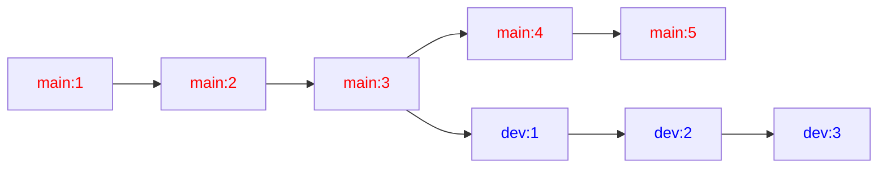
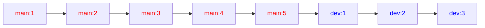
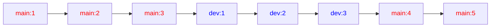
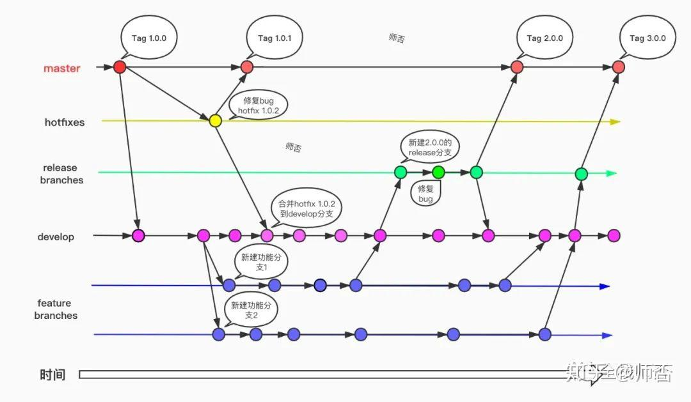
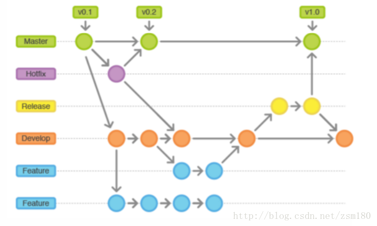

# Git

> 时间：2025/11/29
>
> 作者：clcwdans
>
> 参考：[【GeekHour】一小时Git教程_哔哩哔哩_bilibili](https://www.bilibili.com/video/BV1HM411377j?spm_id_from=333.788.videopod.sections&vd_source=ba0d19c8247bebc4f7849be5e7f55144)
>
> 日记：

## 一、初始配置

1. 用户配置

   ```bash
   git config --global user.name "{name}"
   git config --global user.email "{email}"
   ```

   参数【`--global`】

   - 省略（`Local`） 本地配置，仅对本地仓库有效

   - `--global` 全局配置，所有仓库生效
   - `--system` 系统配置，对所有用户生效  

   参数【`"{name}"`】

   - 如果 `{name}` 中间没有空格，双引号可省略

2. 保存用户密码
   ```bash
   git config --global credential.helper store
   ```

   保存用户名和密码，不用每次输入

3. 查看配置信息

   ```bash
   git config --global --list
   ```

4. 更改默认分支名

   ```bash
   # 有的 git 版本中默认分支名仍为 master，为适配 GitHub （默认分支已转为 main），可以将本地分支名改为 main
   git branch -m main
   ```

   

以上命令安装后只执行一次即可

## 二、新建版本库（仓库）/ Repository (Repo)

1. 在本地目录下建立版本库

   ```bash
   git init
   # 会创建一个 .git 隐藏目录
   ```

2. 远程克隆已有的库

   ```bash
   git clone {仓库url}
   ```

## 三、Git 工作区域和文件状态

工作区域：

1. 工作区（Working Directory）`.git` 所在目录

   资源管理器中看到的目录

2. 暂存区（Staging Area/Index）`.git/index`

   保存即将提交到 Git 仓库的修改内容

3. 本地仓库（Local Respsitory）`.git/objects`

   通过 ```git init``` 创建的仓库，是 Git 存储代码和版本信息的主要位置

工作区 --- `git add` --> 暂存区 --- `git commit` --> 本地仓库

文件状态：

1. <font color="#66CCFF"> 未跟踪（Untrack）</font>

   没有被 git 管理的文件

2. <font color="#9370DB">未修改（Unmodified）</font>

   被 git 管理，但还没被修改的文件

3. <font color="#DBDB70">已修改（Modified）</font>

   被 git 管理的已修改过，但还没加入到暂存区中的文件

4. <font color="green">已暂存（Staged）</font>

   修改后提交到暂存区中的文件


## 四、添加和提交文件

```bash
git status # 查看当前仓库状态

git add {files}

git commit {files} -m "{message}" # 如果不使用 -m，会打开一个交互界面，把修改信息写在第一行
git commit -a # 添加后提交
git commit -am "{message}"
git commit -a # 添加后提交
git commit -am "{message}"

git log # 查看提交记录
git log --oneline # 显示更为简洁的提交记录
```

> **Tip: **关于 `git status -s`:
>
> `git status -s` 是 Git 命令，用于以简短格式显示工作目录和暂存区的状态。文件名前的两个字母表示文件状态，具体含义如下：
>
> 状态代码说明：
>
> - A：文件已添加到暂存区（新增文件）
> - M：文件已修改但未提交
> - D：文件已删除
> - R：文件已重命名
> - C：文件已复制（需配置 status.renames 为 "copy"）
> - U：文件更新但未合并（如冲突后未解决）
> - ?：未跟踪的文件（未被 Git 管理）
>
> ```bash
> $ git status -s
>  M git.md
> ?? .gitignore
> # 状态栏第一列表示暂存区状态，第二列表示工作区状态
> ```

## 五、回退版本

```bash
git reset --soft {version_id} # 回退到某版本并保留工作区和暂存区的修改内容
git reset --hard {version_id} # 回退到某版本并删除保留在工作区和暂存区的修改内容
git reset --mixed {version_id}# 默认，回退到某版本，仅清空暂存区

git ls-files # 查看暂存区内容
```

其中，`{version_id}` 处可用 `HEAD^` 或 `HEAD~` 表示上一次提交版本

> **Tip: **`HEAD~` 与 `HEAD^`
>
> Git 中，`HEAD^` 和 `HEAD~` 的区别主要在于它们指向的提交对象不同：
>
> - `HEAD^`
>   指向当前提交的‌第一个父提交‌（即直接前驱提交）。
>   适用于合并提交（有多个父提交时），默认选择第一个父提交。 ‌
> - `HEAD~`
>   指向当前提交的‌上一级提交‌（即直接前驱提交）。
>   无论提交是否有多个父提交，均按提交链顺序后退。
> - 组合用法
>   `HEAD~~` 等价于 `HEAD~2`（后退两步）。 ‌
>   `HEAD^^` 等价于 `HEAD‌:ml-citation{ref="1" data="citationList"}1`（后退两步，但选择第一个父提交）。
>   ~~（这个等价也是看不懂一点）~~

> **Tip: **<font color="red">！谨慎使用 `--hard`</font>
> 但 git 中所有操作均可回溯
>
> ```bash
> git reflog # 查看误操作前的版本号，再用 reset 还原即可
> ```


## 六、使用 `git diff` 查看差异

```bash
git diff # 显示工作区和暂存区之间的文件差异
git diff HEAD # 比较版本库和工作区之间的差异
git diff --cached # 比较版本库和暂存区
git diff {version_id1} {version_id2}
git diff {vid1} {vid2} {file_name} # 查看提交 vid1 和 vid2 中指定文件的差异
```


## 七、使用 `git rm` 删除文件

删除文件的方法1：

```bash
rm {file} # 在工作区中删除
git add {file} # 添加修改到暂存区中，或者 git add . 也行
```

删除文件的方法2：

```bash
git rm {file} # 在工作区和暂存区中的文件都被删除
```

删除后不要忘记提交，否则版本库中没有发生变化。

## 八、`.gitignore` 文件

1. 简介
   `.gitignore` 文件中列举了不需要被加入到版本库中的文件，这些文件将在提交时被忽略。

   一般来说 `.gitignore` 文件中包括了：
   - 系统或软件自动生成的文件
   - 编译产生的中间文件和结果文件
   - 运行时生成的日志文件、缓存文件、临时文件
   - 涉及身份、密码、口令、密钥等敏感信息的文件

   ```.gitignore
   *.log
   *.class
   *.o
   *.exe
   temp/
   # 我是注释
   ```

   > git 默认不会将空文件夹纳入版本控制当中
   > `temp/` 为文件夹，后面的斜杠不能省 

2. 文件匹配规则

   - `*` 通配任意个字符
   - `?` 匹配单个字符
   - `[]` 匹配列表中的单个字符，如：`[abc]` 表示 `a/b/c`
   - `**` 表示匹配任意的中间目录
   - `[0-9]` `[a-z]` 等 匹配序列中的任意一个字符

   ```.gitignore
   # 忽略所有 .a 文件
   *.a
   
   # 跟踪所有 lib.a，即便前面忽略了 .a 文件
   !lib.a
   
   # 只忽略当前目录下的 TODO 文件，不忽略其他子目录下的 TODO 文件
   /TODO
   
   # 忽略任何目录下名为 build 的文件夹
   build/
   
   # 忽略此形式目录下的文件
   doc/*.txt
   ```

3. 注意事项
   注意：**`.gitignore` 文件对先前已加入版本库中的文件无效**

   需先将其从版本库中删除：

   ```bash
   git rm --cashed {file}
   git commit -am "delete {file}""
   ```

## 九、Github 的使用和远程仓库操作

1. 在本地创建 **SSH密钥**

   > **Tip: **关于 SSH
   >
   > ```AIGC
   > SSH（Secure Shell，安全外壳协议）是一种用于加密远程登录和安全网络服务的协议，通过加密和认证机制保护数据传输安全。
   > 
   > 核心功能：
   > SSH主要用于加密本地机器与远程服务器之间的通信，确保数据在传输过程中不被窃取或篡改。它替代了不安全的Telnet协议，广泛应用于服务器管理、文件传输等场景。
   > 
   > 工作原理：
   > SSH基于C/S架构，交互流程包括：
   > 
   > 建立连接：客户端与服务器握手。
   > 版本号协商：确定协议版本。
   > **密钥交换**：生成加密密钥。
   > **用户认证**：通过密码或密钥验证身份。
   > 会话交互：加密传输命令和数据。
   > 会话关闭：断开连接
   > ```
   >
   > 以上内容由AI生成
   >
   > 
   >
   > 总结：SSH 是一种 **<u><span title="就像是HTTPS、HTTP那样的东西，表示连接不同操作系统与硬件体系结构的网络通用语言">网络通信协议</span></u>**，它的特点就是 **一次配置，免输凭证，操作高效**，只需要以下步骤就可以实现长期连接而不需要发送密码或令牌：
   >
   > - 本地生成公钥 + 私钥
   >
   > -  公钥上传到 GitHub
   > -  后续操作自动用私钥验证，无需输密码 / 令牌
   >
   > 
   >
   > 就是说，SSH 本身和 GitHub 并没有什么关系，只是 GitHub 提供了通过 SSH 协议来访问的方式
   >
   > 在本地计算机中，一般有一个 .ssh 文件夹，用于存储该计算机在通过 SSH 协议访问网络时的密钥
   >
   > 这个文件夹一般在系统盘的用户目录下，即 `C:\Users\{系统登录的用户名}`下，就是 git bash 里的 `~` 目录
   >
   > `.ssh` 文件夹中一般存有 `密钥名` `密钥名.pub` 和 `config` 三种文件
   >
   > - `密钥名.pub` 文件：含生成的公钥，一般需要复制到要访问的网站上，如 Github
   > - `密钥名` 文件：含生成的私钥，由于访问网站时验证自己是公钥的持有者，泄露有风险，禁止泄露
   > - `config` 文件：用于配置 SSH 协议访问不同网站时所用的密钥以及端口等信息
   >
   > 
   >
   > SSH 协议访问时分为以下几步：
   >
   > 1. 身份请求：向服务器发送「登录请求」，并告知：「我持有对应公钥的私钥，请求验证」
   > 2. 加密挑战：服务器生成一个「随机字符串」，用该公钥对其加密（只有对应的私钥能解密），然后将加密后的字符串发送给本地机器
   > 3. 解密响应：本地机器用自己的私钥解密该字符串，得到原始随机字符串，再将原始字符串发送回服务器

   创建 SSH 密钥的方法：

   ```bash
   cd ~/.ssh # 移动到 .ssh 文件夹
   
   # ssh-keygen 是 Git 自带的一个 ssh 密钥生成工具
   # -t [加密模式] 一般选用 rsa 或 ed25519
   # -b [长度] 4096 就行，一般不加用默认的也行
   # -C "[用户]" 不加也行，只是便于分清创建人
   ssh-keygen -t rsa -b 4096 -C "用户，一般为 GitHub 邮箱"
   # 执行时首先会出现以下语句：
   # Generating public/private ed25519 key pair.
   # Enter file in which to save the key (/c/Users/13403/.ssh/id_ed25519):
   # 此时是要求输入 ssh 密钥的文件名（密钥名）
   # 如果是第一次生成，可以之间按 Enter 键，直接采用默认名字，即 "id_加密方式"
   # 如果不是第一次生成可以选择使用默认名但覆盖掉之前的密钥，或者再自己输入一个密钥名
   
   # 然后出现以下语句：
   # Enter passphrase for "/c/Users/13403/.ssh/id_ed25519" (empty for no passphrase):
   # 这时要求输入使用该密钥的密码，以后使用密钥时都要先输入密码
   # 如果不想要设置密码，直接按 Enter 就行
   # PS：这个密码只是本地设置的使用密钥时用的密码，和网络端（如 Github）没关系，但一般访问网络端要用到密钥时就会提示要求输入密码
   
   # 再之后，出现类似以下内容，就生成成功了
   # Your identification has been saved in /c/Users/13403/.ssh/id_ed25519
   # Your public key has been saved in /c/Users/13403/.ssh/id_ed25519.pub
   # The key fingerprint is:
   # SHA256:Xfr3T4zgpvRASpbMpJuyutxGdembRw5OJKqrouGkeGk 13403@clcwdans
   # The key's randomart image is:
   # +--[ED25519 256]--+
   # |                 |
   # |                 |
   # |        ..  .    |
   # |      o=+o o     |
   # |     o.=S + .    |
   # |    o  =+o.o . o |
   # |.. +. oo.*o + o o|
   # |*oE..o  +.o= . o |
   # |B===o    .. .   +|
   # +----[SHA256]-----+
   # 此时 .ssh 文件夹中会出现 密钥名（私钥） 和 密钥名.pub（公钥） 文件
   
   cat [密钥名].pub
   # 查看生成的公钥文件，形如：
   # ssh-rsa AAAAB3NzaC1yc2EAAAADAQABAAACAQC9eTMu5MHgfXn+dWbN+pSY2PzmRmnlEEu6dqSqOqqKeh7dXyoxMhvvsN1PhCTMw9Z2AOjT4sFe0D44HSjAk5390/8yWGxcyFUB9ctYCJ6T9VY+dCgQeapuv2wxLStiBKp1RGY+V4yTQTYfWcxbWaVwIUgcrBVhyTAtTd9xbVkg4GQ6CR57FiX9bJCC77BsyWSnVy/FN40CiFQpFOXiZjJPWwMfJOg0Z89cAvsvf7xNxgIYFdpmLs8dnFjymRaNCxY2OQMA69kjMeA2oJD8MIgumZ+nZahv7grAH2YU0GgXyLH2gWg3LFYGz/Pv5QS74vE+dA2+rUqe8Kt7fVhACj+Y/bMaGfwZO0OxuOoOiWpFHaHre8dlucPiTfb3HD6rATtzQiNpqcpH0YFvtxC5BlalPsaQlrUvXkkWAnwZwn1tXJeu66CDRYS26QaKw1C7AgRCTMbuTxth6RPkB4qbi20uUpdiA16AjvJqjKIppbsWmK4OpY4Tm6qZl8BHcMSmZHYoP6Z+0wkjqAc1/11oz5eO8Q4nE/GORGVtSEdMQzTnL78Yv08n7HTdcv7J0dADHj0zwzo+2X8cSsLuU9WWmVQ/cXZMwxvbYzqxwUbSwgZ25wA2cIpHwPhMsHChnf6PX23SOmiNbr0ian7+dVVLRIHy6VvOyBF9NCa6FV/7GcvX7w== 13403@clcwdans
   ```

2. 在 github 上添加 SSH 公钥

   右边头像 -> settings -> Access-SSH and GPG keys -> 输入Title（GitHub上的密钥名称，~~可以随便打一个~~）-> 粘贴自己的 **公钥** -> 输入 Github 账号的密码（这是在给别人访问自己仓库的权限，当然要输密码确定啦）-> 搞定

3. 在本地配置 `config` 文件

   ```config
   # github
   Host github.com # 表示此 Host（主机）的别名，下方定义访问该 Host 时的配置
       # 实际要访问的 Host 名，不加 ssh. 默认从 22 端口访问，加了默认从 443 端口访问
       HostName ssh.github.com 
       # 连接这个 Host 时默认使用的登录用户
       User git
       # 强制 SSH 客户端优先（或仅）使用「公钥认证」方式完成身份验证，而非密码、键盘交互等其他认证方式
       PreferredAuthentications publickey
       # 默认使用的私钥
       IdentityFile ~/.ssh/id_rsa
       # 默认端口设置为 443端口
       Port 443
   ```

   > **Tip：** 端口问题
   >
   > 1. 22 端口一般是主机提供 SSH 服务的端口，而 443 端口提供 HTTPS 服务
   > 2. `github.com:22` 为 SSH 服务，`github.com:443` 为 HTTPS 服务
   > 3. `ssh.github.com:22` 和 `ssh.github.com:443` 均提供 SSH 服务
   > 4. 在校园网、公司网等中由于安全问题，端口 22 一般会被禁用
   > 5. HostName 那里写 `github.com` 时默认从 22 端口访问，写 `ssh.github.com` 时默认从 443 端口访问
   >
   > ~~这个端口问题搞了一天了，不是 refused 就是closed，真是服了~~

   ```bash
   ssh -T git@github.com # 用于测试是否能连接成功
   # 如果显示：
   # Hi [Github 用户名]! You've successfully authenticated, but GitHub does not provide shell access.
   # 则表示成功
   # 如果还是 refused 或者 closed 就慢慢调把哈哈
   ```

4. github 创建仓库

   左上角 logo -> 左边绿色按钮 `Create Repository` 

   可以看到 github 的提示：

   - Quick setup 栏：两种创建模式 `HTTPS` `SSH` 
     - `HTTPS`：push 时需要验证 **用户名和 PAT**
     
       > 以前是直接输入 Github 用户名和 Github 密码来访问的
       >
       > 但 GitHub 2021 年后已禁用密码登录，用 PAT（Personal Access Token） 替代了密码，以明文形式永久保存在本地文件中
       >
       > 第一部分的 `git config --global credential.helper store` 命令默认保存了访问 Github 的 PAT 等，所以也不用输入，可以通过 可以通过 ` git config --global --unset-all credential.helper` 关掉，但关掉也没用，因为还会有 Windows 自带的 wincred 等帮助存储 ~~（那 HTTPS 不是比 SSH 还要方便~~
       >
       > ~~不知道为什么我没有创建 PAT 也能通过 HTTPS 访问，按理来说应该至少要生成一次再存储啊~~
       >
       > 额，他好像是会自己生成，在 windows凭据管理器 -> windows凭据 中可以找到，虽然我还是不知道他是啥时候生成的
       >
       > 正常的生成 PAT 的流程应该是通过 GitHub 主页 -> settings -> developer settings  -> Personal Access Token 生成
     
     - `SSH`：不需要验证，但需在 GitHub 上添加 **SSH公钥** 的配置
     
   - 第一栏：本地还没有仓库

   - 第二栏：本地已有仓库

   - 第三栏：导入其他的仓库 ~~(不知道干嘛用的)~~

5. `git remote add` 添加远程仓库

   > 先说一下 clone：
   > ```bash
   > # 从远程克隆，一般在修改或使用远程仓库中代码而本地无该项目版本库时使用
   > git clone git@github.com:{...}
   > # 后面那一串是 GitHub 上创建时给的 SSH url
   > ```
   > 此时若还没配置 SSH 密钥会提示是否有访问权限 
   > 配置好 SSH 密钥后，再次 `git clone`，要求输入密码，输入 `test.pub` 中的内容即可

   `git remote` 主要用于有关远程仓库的命令

   ```bash
   # 添加远程仓库
   git remote add [别名，一般默认叫 origin] [url]
   # 更改别名的 url
   git remote set-url [别名，一般默认叫 origin] [url]
   # 此处的别名是 git 本身用于替代过长的 url 所用的，可随便设一个，但一般叫 origin
   # url ssh 或者 https 都行，只是之后进行 pull 和 push 时会有所不同
   # 此时并不会使用到 SSH 密钥，或者 PAT，只有在进行 pull fetch push 等操作时才使用
   
   git remote -v
   # 查看仓库别名和 url
   ```

6. 与远程仓库同步 `git pull` 和 `git push`

   ```bash
   git pull # 从远程仓库拉取
   git push # 将本地修改推送到远程仓库上
   git fetch # 获取远程修改，但不自动合并
   ```

   用法：

   ```bash
   git push -u origin main:main
   # 把本地的 main 分支和远程的 main 分支关联起来
   # 分支相同时可写成一个，如
   git push -u origin main
   # -u 表示绑定分支，以后直接 git push 即可
   
   git pull {远程仓库名}{远程分支名}:{本地分支名}
   git pull # 省略时，默认为 git pull origin main
   # 执行这些操作时会要求输入ssh密钥的使用密码（SSH，在配置时添加了密码）或者用户名及PAT（HTTPS）
   ```

   > **Tip：** <font color="red">！本地和远程仓库不同时，一定要先 pull 后 push</font>
   >
   > 如果有其他人更修改过代码，一定要先拉取，判断合并是否受影响再推送，GitHub 本身也禁止 “未 pull 先 push” 的行为（好像）

## 十、`gitee` 和 `GitLab`

1. 特色
   - `gitee` 国内平台
   - `GitLab` 私有化部署

2. `GitLab` 的私有化部署（暂时不学）

## 十一、在 `VSCode` 中使用 `git`

1. 提交

   更改 ->  `+` （添加到暂存区）-> 输入信息 -> `提交` -> `同步`（与远程仓库同步）

2. 各类操作

   - `提交`：git commit
   - `提交（修改）`：git add 并 git commit
   - `提交和推送`：git commit 并 git push
   - `提交和同步`：git commit 并 pull 和 push

   

## 十二、git 分支（branch）

1. 查看分支

   ```bash
   git branch
   # 查看当前所有分支
   
   # 输出
   * main
   # * 表示当前分支
   ```

2. 创建分支

   ```bash
   git branch [branch_name]
   ```

3. 切换分支

   ```bash
   # 原来通过 checkout 切换
   git checkout [to_branch]
   # 但由于 checkout 也被用来删除文件修改，有歧义，git 官方又加入了一个命令
   git switch [to_branch]
   ```

4. 合并分支

   ```bash
   git switch main
   git merge [branch_to_be_merged]
   # 将 [branch_to_be_merged] 分支上的内容合并到当前分支上
   # 要先移动到 main 分支
   ```

5. 查看分支树

   ```bash
   git log --graph --oneline --decorate --all
   ```

6. 删除分支

   ```bash
   git branch -d [branch_to_be_deleted]
   # 上面的命令只有在分支被合并之后才能使用
   
   git branch -D [branch_to_be_deleted]
   # 没合并用上面的命令删除
   ```

## 十三、解决合并冲突

修改了同一行代码后，git 不知道怎么合并，就会出现合并冲突

合并失败后，可通过以下方式查看冲突：

- ```git status```
- ```git diff```

此时需要自己修改文件，解决冲突，解决后自动完成合并

也可以通过：

```bash
git merge --abort
```

来取消该次合并

## 十四、变基（Rebase）

就是 “从公共节点截取 -> 嫁接到当前分支末端” 的过程，很难描述，RT



通过：

```bash
git switch dev
git rebase main
# 把 dev 的 base 改到 main 上
```

变成：



或者通过：

```bash
git switch main 
git rebase dev
```

变成：



> **Tip：** `merge` 和 `rebase`
>
> - `merge` 
>   - 优点：不会破坏原来分支的提交历史，方便回溯和查看
>   - 缺点：会产生额外的提交节点，分支图复杂
> - `rebase`
>   - 优点：不会新增额外的提交记录，形成线性历史，比较直观
>   - 缺点：会改变提交历史，一般不在公共分支上使用

## 十五、回退

```bash
git checkout -b [branch] [commit_id]
# -b [branch] 表示回退到指定分支的 [commit_id] 提交处

git switch main
git reset [mod] [commit_id]
```

## 十六、分支管理和工作流模型

1. **Git Flow 工作流模型：**

   

   

   #### 1. master分支

   主分支，产品的功能全部实现后，最终在master分支对外发布。

   #### 2. develop分支

   开发分支，基于master分支克隆，产品的编码工作在此分支进行。

   #### 3. release分支

   测试分支，基于delevop分支克隆，产品编码工作完成后，发布到本分支测试，测试过程中发现的小bug直接在本分支进行修复，修复完成后合并到develop分支。本分支属于临时分支，目的实现后可删除分支。

   #### 4. hotfix分支

   Bug修复分支，基于master分支或发布的里程碑Tag克隆，主要用于修复对外发布的分支，收到客户的Bug反馈后，在此分支进行修复，修复完毕后分别合并到develop分支和master分支。本分支属于临时分支，目的实现后可删除分支。

   #### 5. feature分支

   功能特征分支，基于develop分支克隆，主要用于多人协助开发场景或探索性功能验证场景，功能开发完毕后合并到develop分支。feature分支可创建多个，属于临时分支，目的实现后可删除分支。

2. 版本号（Tag）规则：

   - 主版本（Major Version）：主要的功能变化或重大更新
   - 此版本（Minor Version）：一些新的功能、改进和更新，通常不会影响现有功能
   - 修订版本（Patch Version）：一些小的 bug 修复。通常不会更改现有的功能和接口

3. 其他工作流模式
   - GitHub Flow
